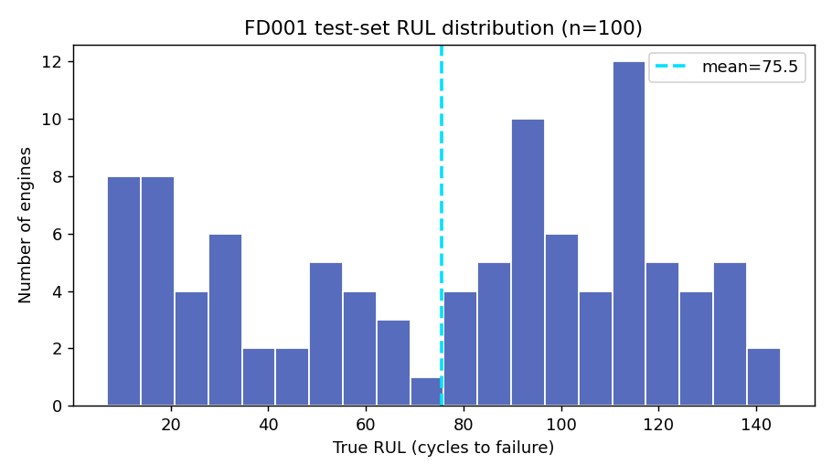
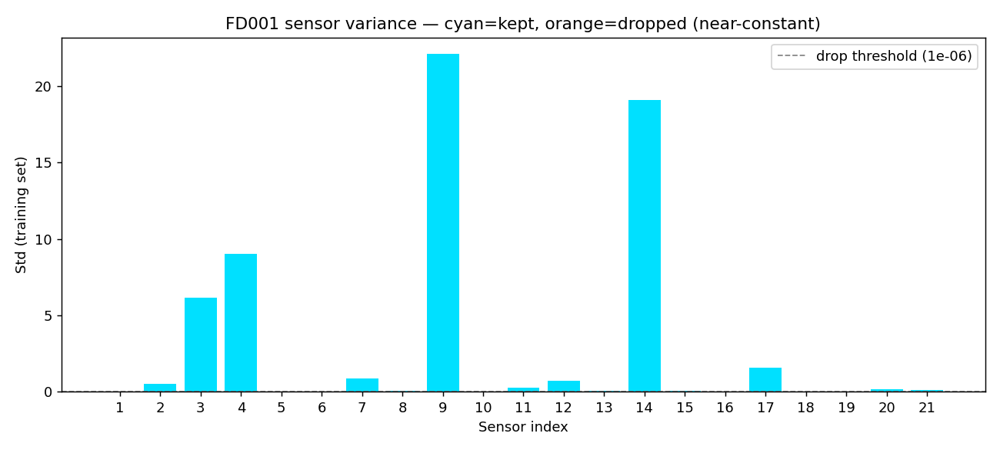
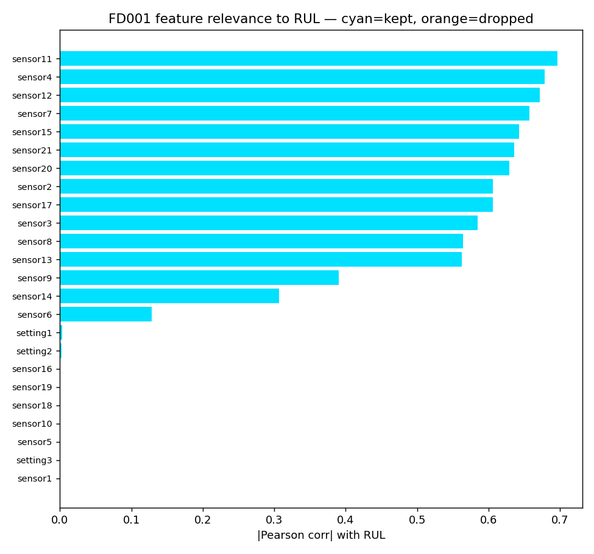
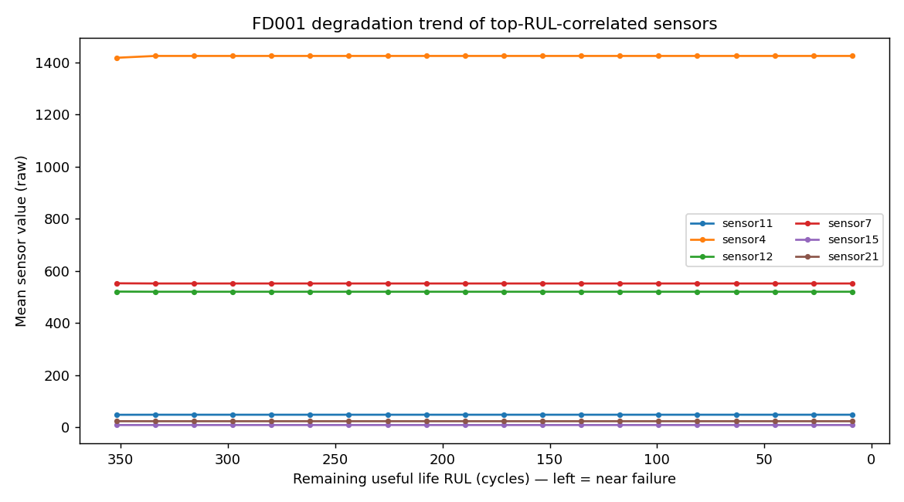
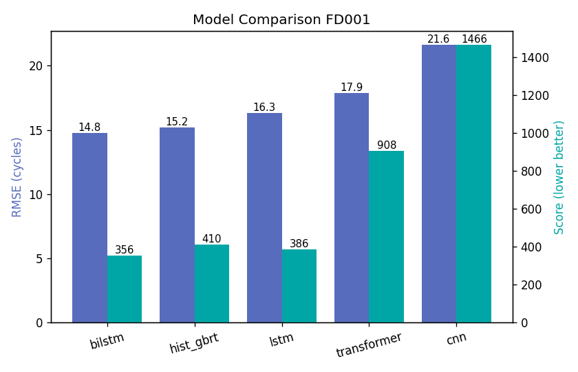

# 设备故障预测 · 剩余寿命（RUL）估计 — C-MAPSS

> 🌐 **[在线展示页](https://sunnyingyang-cpu.github.io/cmp-rul-prediction/)**

> 基于 NASA C-MAPSS 涡轮发动机退化仿真数据，构建**剩余有用寿命（Remaining Useful Life, RUL）**&#x9884;测系统：  
> 输入发动机多传感器时序，输出「还能安全运行多少个循环」，用于预测性维护（Predictive Maintenance）。
>
> 项目特点：**传统机器学习 + 深度学习多路线对比**、**可复现的端到端管线**、**ONNX 导出 + REST 部署**。

**目录**

|                                           |                               |
| :---------------------------------------- | :---------------------------- |
| [1. 项目背景与痛点](#1-项目背景与痛点)                  | [6. 工程结构](#6-工程结构)            |
| [2. 数据集：NASA C-MAPSS](#2-数据集nasa-c-mapss) | [7. 快速开始](#7-快速开始)            |
| 　└ [2.1 数据探索（EDA）](#21-数据探索eda)           | [8. 技能匹配](#8-技能匹配)            |
| [3. 方法：多路线对比](#3-方法多路线对比)                 | [9. 诚实声明](#9-诚实声明)            |
| [4. 实测结果（FD001）](#4-实测结果fd001)            | 📖 [数据集使用说明](docs/DATASET.md) |
| [5. 部署](#5-部署)                            |                               |

---

## 1. 项目背景与痛点

在风电、航空、制造等工业场景，关键设备一旦突发故障，轻则停机损失、重则安全事故。  
传统「定期维修」要么过度维护（浪费），要么维护不足（漏检）。**预测性维护**的思路是：  
持续采集设备运行传感器，预测「还能撑多久（RUL）」，在故障前安排检修。

- **慢**：人工看振动/温度曲线，难以从海量时序中识别退化趋势。
- **漏**：退化往往是缓慢、低信噪比的，人眼容易误判。
- **贵**：依赖专家经验，难以规模化复制到整条产线/整个机队。

→ 用机器学习把「传感器时序 → RUL」做成可自动、可复制的预测模型，是工业 AI 落地的典型高价值场景。

---

## 2. 数据集：NASA C-MAPSS

C-MAPSS（Commercial Modular Aero-Propulsion System Simulation）是 NASA 公开的涡扇发动机  
**运行至失效（run-to-failure）**&#x4EFF;真数据集，是设备剩余寿命预测领域的标准基准。

- 每条轨迹 = 一台发动机的退化过程；初始带制造差异，运行中逐渐退化直至失效。
- 每行 = 一个运行循环（cycle）的快照，共 **26 列**：`unit(1) + cycle(1) + 工况设置(3) + 传感器(21)`。
- 数据含传感器噪声；训练集跑到失效（RUL 已知），测试集在失效前截断（只给真实 RUL 标签）。

| 子集    | 训练引擎 | 测试引擎 | 工况数 | 故障模式      |
| :---- | :--- | :--- | :-- | :-------- |
| FD001 | 100  | 100  | 1   | 1（HPC 退化） |
| FD002 | 260  | 259  | 6   | 1         |
| FD003 | 100  | 100  | 1   | 2         |
| FD004 | 249  | 248  | 6   | 2         |

> 数据来源（公开镜像，已校验列数与引擎数）：[github.com/NicolasDeHorta/CMAPSSData](https://github.com/NicolasDeHorta/CMAPSSData)。  
> 原始数据由 NASA PCoE 发布，本项目仅作算法验证与学习用途。  
> ⚠️ 上表为**本仓库镜像数据的实测值**。官方口径中 FD004 为「训练 248 / 测试 249」，与镜像**恰好对调**；  
> 本项目以镜像为准（已校验自洽），详见 [docs/DATASET.md](docs/DATASET.md) 第 4 节。

📖 **数据集正确使用指南（格式 / train-test-RUL 关系 / 多工况差异 / 常见误用）详见 [docs/DATASET.md](docs/DATASET.md)。**

### 2.1 数据探索（EDA）

动手建模前，先用 `tools/eda.py` 对原始时序做探索，回答「特征选择是否合理、退化信号在哪」：

- **标签分布**：测试集 RUL 均值 **75.5**、标准差 **41.6**，说明测试发动机是在退化**不同阶段**被「中途截断」的，  
  比训练集（跑到失效）更难——这是 C-MAPSS 的核心难点，也解释了模型在测试集上误差高于训练。
- **特征有效性（方差）**：训练集上 6 个传感器（`sensor1/5/10/16/18/19`）方差≈0（恒定），  
  被 `preprocess.select_features` 剔除；保留 18 个特征（3 工况 + 15 有效传感器）。
- **RUL 相关性**：与 RUL 最相关的传感器为 `sensor11/4/12/7/15/21`（|Pearson|≈**0.64–0.70**），  
  正是后续模型主要依赖的退化信号；被剔除的恒定传感器相关性≈0。
- **退化趋势**：上述传感器随「剩余寿命」下降呈**单调漂移**（见下图），印证「用最近窗口捕捉退化」的建模思路。









> FD001 为单一工况，3 个 `setting` 列近乎恒定；在 FD002/FD004（多工况）中 setting 会携带信息，  
> 管线已通过「仅训练集拟合并**按子集独立选特征**」自动适配（如 FD002/004 选中 24 个特征）。

---

## 3. 方法：多路线对比

本项目不"押注"单一模型，而是**横向对比四条技术路线**，体现模型选型与工程判断力：

| 路线       | 代表方法                        | 说明                                |
| :------- | :-------------------------- | :-------------------------------- |
| 传统 ML 基线 | HistGradientBoosting（梯度提升树） | 相同滑窗输入展平为向量 → 回归；作为对照，证明"传统方法也能做" |
| 循环网络     | LSTM / BiLSTM               | 沿时间维建模退化趋势，取末态隐状态回归 RUL           |
| 卷积网络     | 1D-CNN                      | 沿时间维卷积提取局部退化特征，全局池化后回归            |
| 注意力      | Transformer                 | 轻量自注意力编码器，捕捉长程依赖                  |

**数据预处理管线**（`tools/preprocess.py`，各路线共用、保证可比）：

1. **特征选择**：剔除训练集上方差≈0 的恒定传感器（保留 3 个工况设置 + 有效传感器）。
2. **归一化**：z-score，**仅用训练集统计量拟合**（防信息泄漏），再变换测试集。
3. **滑动窗口**：取最近 `W=30` 个循环作为一个样本；训练集滑窗增广，测试集取每条轨迹最后 30 个循环。
4. **RUL 标签**：训练集 `RUL(t)=轨迹最长循环 − t`，并裁剪到 `[0, 125]`（稳定训练）。

**评估指标**（NASA 竞赛定义）：

- **RMSE**：均方根误差，主指标。
- **Score**：非对称得分——**晚预测（高估剩余寿命）惩罚更重**，因为"该修没修"风险更高。

---

## 4. 实测结果（FD001）

> 下列为 FD001（单一工况、单一故障模式，最易出效果）上的测试结果。**数值来自本项目实际训练**。

| 模型              | 测试 RMSE (cycles) | 测试 Score  | 参数量     |
| :-------------- | :--------------- | :-------- | :------ |
| 传统 ML（HistGBRT） | 15.223           | 410.5     | —（树模型）  |
| LSTM            | 16.308           | 385.9     | 56,897  |
| BiLSTM          | **14.788**       | **355.7** | 146,497 |
| 1D-CNN          | 21.637           | 1,465.6   | 10,273  |
| Transformer     | 17.895           | 907.9     | 18,785  |



各模型的训练/验证损失曲线与「预测 vs 真实 RUL」散点图见 `runs/<model>_FD001/`。

**结论**：深度学习序列模型整体优于传统 ML 基线；其中 **BiLSTM** 在 RMSE/Score 上均表现最佳  
（RMSE 14.79 / Score 355.7），体现了「用对的结构建模时序退化」的价值。同时传统 ML 基线  
（HistGBRT，RMSE 15.22）作为轻量、可解释的对照，与深度模型差距不大，在生产中仍可作为快速上线或兜底方案。  
值得注意：1D-CNN 与 Transformer 在本配置下未充分调优（CNN 过拟合严重、Score 偏高），说明「模型选型 + 调参」比「盲目上复杂模型」更重要——这也是工程落地中的真实取舍。

---

## 5. 部署

模型可导出为 **ONNX**，脱离 PyTorch 直接由推理引擎加载，再包一层 Flask 服务对接产线：

```bash
# 1) 导出 ONNX（含预处理元信息）
python tools/export_onnx.py --model bilstm --subset FD001

# 2) 启动 REST 服务
python utils/flask_rest_api/restapi.py --model bilstm --subset FD001 --port 5000

# 3) 调用（示例客户端，或见 utils/flask_rest_api/example_request.py）
curl -X POST http://127.0.0.1:5000/predict \
  -H "Content-Type: application/json" \
  -d '{"engine_id":"FD001_001","cycles":[[...26 列...], ...]}'
# => {"engine_id":"FD001_001","rul":78.3,"unit":"cycles"}
```

推理端会**复现与训练完全一致的预处理**（特征选择 + z-score），保证线上线下一致。

---

## 6. 工程结构

```
cmp-rul-prediction/
├── datasets/                 # C-MAPSS 原始 txt（.gitignore 排除）
├── models/build.py           # LSTM / BiLSTM / 1D-CNN / Transformer 定义
├── tools/
│   ├── config.py             # 全局超参
│   ├── preprocess.py         # 数据预处理管线（特征选择/归一化/滑窗/RUL标签）
│   ├── train.py              # 训练 + 评测 + 出图
│   ├── baseline_ml.py        # 传统 ML 基线
│   ├── export_onnx.py        # ONNX 导出
│   ├── compare.py            # 多模型结果汇总对比
│   ├── eda.py                # 时序数据探索（EDA：分布/方差/相关性/退化趋势）
│   ├── check_env.py          # 环境自检（依赖/数据自洽性/特征选择/模型前向，秒级）
│   └── metrics.py            # RMSE / Score / 绘图
├── utils/flask_rest_api/     # Flask REST 推理服务 + 示例客户端
├── runs/                     # 训练产物（.gitignore 排除）
├── weights/                  # ONNX 模型（.gitignore 排除）
├── docs/figures/             # 说明文档配图（含 eda/ 子目录，入库）
├── docs/DATASET.md           # 数据集正确使用说明
├── README.md / SETUP.md
├── requirements.txt
└── LICENSE（MIT）
```


---

## 7. 快速开始

```bash
# 1) 准备数据：把 12 个 txt 放到 datasets/（见第 2 节镜像链接）
# 2) 安装依赖
pip install -r requirements.txt
# 2.5) 环境自检（推荐：秒级，校验依赖/数据自洽性/模型前向）
python tools/check_env.py
# 2.6) 数据探索（EDA，可选，产出 docs/figures/eda/）
python tools/eda.py --subset FD001
# 3) 训练（四选一或全跑）
python tools/train.py --model lstm --subset FD001 --device cpu
python tools/train.py --model transformer --subset FD001 --device cpu
python tools/baseline_ml.py --subset FD001
# 4) 汇总对比
python tools/compare.py --subset FD001
# 5) 导出 + 部署
python tools/export_onnx.py --model bilstm --subset FD001
python utils/flask_rest_api/restapi.py --model bilstm --subset FD001
```

> GPU：把 `--device cuda` 即可（需本地有 CUDA 环境）。

---

## 8. 技能匹配

| 技能要求（典型）                  | 本项目提供的证据                            |
| :------------------------ | :---------------------------------- |
| 时序数据处理 / 特征工程             | 滑窗样本构造、恒定传感器剔除、z-score 归一化（防泄漏）     |
| 机器学习 / 回归建模               | HistGradientBoosting 传统 ML 基线       |
| 深度学习（RNN/CNN/Transformer） | LSTM/BiLSTM、1D-CNN、Transformer 序列建模 |
| 模型训练与调优                   | 早停、梯度裁剪、MSE 损失、超参集中管理               |
| 评估与指标设计                   | RMSE + 非对称 Score（贴合业务风险）            |
| 模型部署                      | ONNX 导出 + Flask REST 服务，线上线下预处理一致   |
| 工程规范 / 可复现                | 端到端脚本化管线、配置集中、结果可复现                 |

---

## 9. 诚实声明

- 数据集为 NASA 公开基准（C-MAPSS），非私有产线数据；本项目聚焦**算法/管线/部署能力**展示。
- 所有指标均来自本项目在本仓库配置下的实际训练与评测，未引用外部论文数值。
- FD002/FD004（多工况 + 多故障）难度更高，本管线已支持，可扩展训练（见 `tools/train.py --subset FD002`）。
